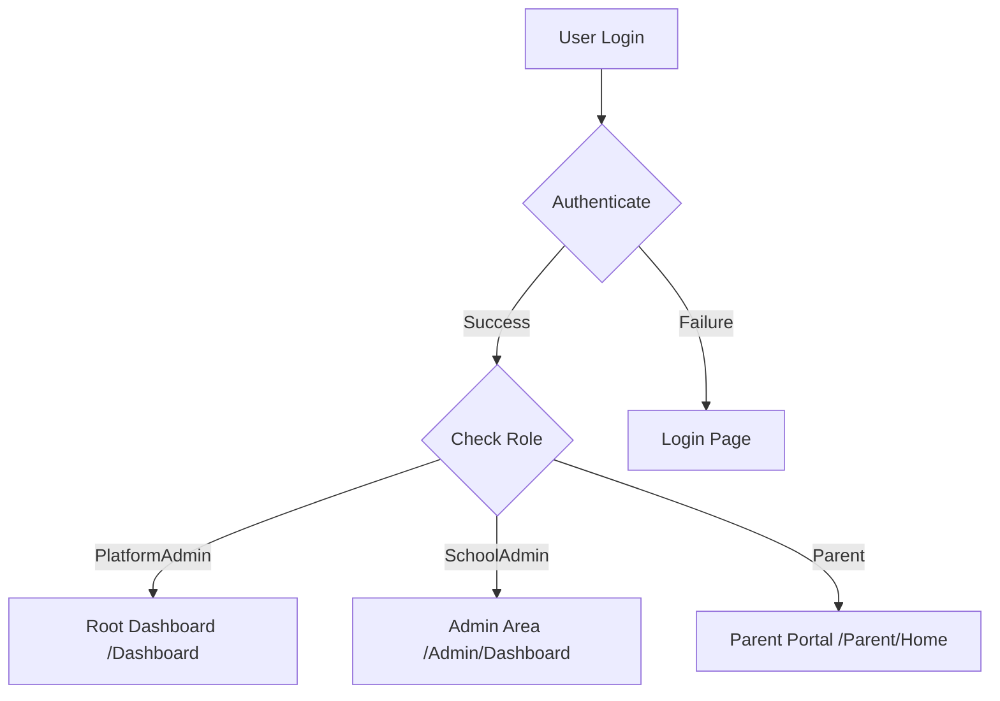

# Role-Based Dashboard System Design

## Overview

The SOAP application will implement a comprehensive role-based dashboard system with three distinct user roles: Platform Admin, School Admin, and Parent. This design ensures SaaS compliance, data security, and appropriate access control while providing each user type with the tools they need to accomplish their goals.

## Architecture

### Role Hierarchy
```
Platform Admin (You)
├── System-wide platform management
├── School account lifecycle management
├── Aggregated analytics and billing
└── Infrastructure and security oversight

School Admin (One per school)
├── Complete control over school data
├── Application and document management
├── Student placement and communication
└── School-specific reporting

Parent (Multiple per school)
├── Personal application tracking
├── Document upload and status
├── Communication with school
└── Application progress monitoring
```

### Authentication Flow


## Components and Interfaces

### 1. Role Management System

#### User Entity Updates
```csharp
public class User
{
    public int Id { get; set; }
    public string PhoneNumber { get; set; }
    public string Role { get; set; } // "PlatformAdmin", "SchoolAdmin", "Parent"
    public int? SchoolId { get; set; } // Null for PlatformAdmin
    public bool IsActive { get; set; }
    // ... existing properties
}
```

#### Role Constants
```csharp
public static class UserRoles
{
    public const string PlatformAdmin = "PlatformAdmin";
    public const string SchoolAdmin = "SchoolAdmin";
    public const string Parent = "Parent";
}
```

### 2. Dashboard Controllers

#### Platform Admin Dashboard
- **Location**: `Controllers/DashboardController.cs` (root level)
- **Route**: `/Dashboard`
- **Purpose**: System-wide platform management
- **Data Access**: Aggregated metrics, school account status, billing data

#### School Admin Dashboard
- **Location**: `Areas/Admin/Controllers/DashboardController.cs`
- **Route**: `/Admin/Dashboard`
- **Purpose**: School-specific management
- **Data Access**: Filtered by user's SchoolId

#### Parent Dashboard
- **Location**: `Areas/Parent/Controllers/HomeController.cs`
- **Route**: `/Parent/Home`
- **Purpose**: Personal application tracking
- **Data Access**: Filtered by user's applications

### 3. Permission Enforcement Middleware

#### Data Filtering Service
```csharp
public interface IDataFilterService
{
    IQueryable<T> ApplyUserFilter<T>(IQueryable<T> query, User user) where T : class;
    bool CanUserAccessSchool(User user, int schoolId);
    bool CanUserAccessApplication(User user, int applicationId);
}
```

#### Authorization Handlers
- **SchoolDataAccessHandler**: Ensures School Admins only access their school's data
- **ParentDataAccessHandler**: Ensures Parents only access their own data
- **PlatformAdminHandler**: Manages platform-level permissions

### 4. Navigation and UI Components

#### Role-Based Navigation
```csharp
public class NavigationService
{
    public NavigationMenu GetMenuForRole(string role)
    {
        return role switch
        {
            UserRoles.PlatformAdmin => GetPlatformAdminMenu(),
            UserRoles.SchoolAdmin => GetSchoolAdminMenu(),
            UserRoles.Parent => GetParentMenu(),
            _ => new NavigationMenu()
        };
    }
}
```

## Data Models

### Dashboard ViewModels

#### Platform Admin Dashboard
```csharp
public class PlatformDashboardViewModel
{
    // System Health
    public SystemHealthMetrics SystemHealth { get; set; }
    
    // School Management
    public List<SchoolAccountSummary> SchoolAccounts { get; set; }
    public int TotalActiveSchools { get; set; }
    public int TotalSuspendedSchools { get; set; }
    
    // Aggregated Analytics (Anonymized)
    public AggregatedUsageMetrics UsageMetrics { get; set; }
    public List<PlatformTrendData> PlatformTrends { get; set; }
    
    // Billing and Subscriptions
    public BillingOverview BillingOverview { get; set; }
}
```

#### School Admin Dashboard
```csharp
public class SchoolDashboardViewModel
{
    // School-Specific Statistics
    public int TotalApplications { get; set; }
    public int PendingApplications { get; set; }
    public int ApprovedApplications { get; set; }
    public int RejectedApplications { get; set; }
    
    // Document Management
    public int TotalDocuments { get; set; }
    public int PendingDocuments { get; set; }
    public int VerifiedDocuments { get; set; }
    
    // School Performance
    public List<MonthlyTrendData> MonthlyTrends { get; set; }
    public List<RecentActivityItem> RecentActivity { get; set; }
    
    // Communication
    public int TotalSmssSent { get; set; }
    public int SmssSentToday { get; set; }
}
```

#### Parent Dashboard
```csharp
public class ParentDashboardViewModel
{
    // Personal Applications
    public List<ApplicationSummary> MyApplications { get; set; }
    
    // Document Status
    public List<DocumentStatus> DocumentStatuses { get; set; }
    
    // Communications
    public List<MessageSummary> RecentMessages { get; set; }
    
    // Important Dates
    public List<ImportantDate> UpcomingDeadlines { get; set; }
}
```

## Error Handling

### Permission Denied Responses
- **Unauthorized Access**: Return 403 Forbidden with role-appropriate error message
- **Cross-School Access**: Log security incident and redirect to appropriate dashboard
- **Invalid Role**: Force re-authentication and role verification

### Audit Logging
```csharp
public class SecurityAuditService
{
    public void LogAccessAttempt(User user, string resource, bool success);
    public void LogPermissionViolation(User user, string attemptedResource);
    public void LogRoleChange(User user, string oldRole, string newRole);
}
```

## Testing Strategy

### Unit Tests
- **Role-based filtering**: Verify data queries are properly filtered by user role
- **Permission enforcement**: Test authorization handlers for each role
- **Dashboard data**: Validate correct data is returned for each role type

### Integration Tests
- **Authentication flow**: Test login redirects to correct dashboard
- **Cross-role access**: Verify users cannot access unauthorized areas
- **Data isolation**: Ensure School Admins cannot see other schools' data

### Security Tests
- **Permission bypass attempts**: Test various ways users might try to access unauthorized data
- **Role escalation**: Verify users cannot elevate their permissions
- **Data leakage**: Ensure no cross-tenant data exposure

## Implementation Phases

### Phase 1: Core Role System
1. Update User entity with new role structure
2. Create role constants and validation
3. Implement basic authentication flow
4. Set up role-based routing

### Phase 2: Dashboard Implementation
1. Create Platform Admin root dashboard
2. Modify existing Admin dashboard for School Admins
3. Enhance Parent dashboard with meaningful content
4. Implement role-based navigation

### Phase 3: Permission Enforcement
1. Create data filtering service
2. Implement authorization handlers
3. Add security audit logging
4. Test cross-role access prevention

### Phase 4: UI and UX Polish
1. Role-specific styling and branding
2. Contextual help and documentation
3. Performance optimization
4. Mobile responsiveness

## Security Considerations

### Data Protection
- **Tenant Isolation**: Strict database-level filtering by SchoolId
- **Audit Trail**: Comprehensive logging of all data access
- **Encryption**: Sensitive data encrypted at rest and in transit

### SaaS Compliance
- **Data Sovereignty**: Customer data remains under school control
- **Access Logging**: All platform admin actions logged and auditable
- **Consent Management**: Explicit authorization required for support access

### Performance
- **Query Optimization**: Efficient filtering to prevent performance degradation
- **Caching Strategy**: Role-appropriate caching with proper invalidation
- **Resource Limits**: Prevent any single tenant from affecting system performance